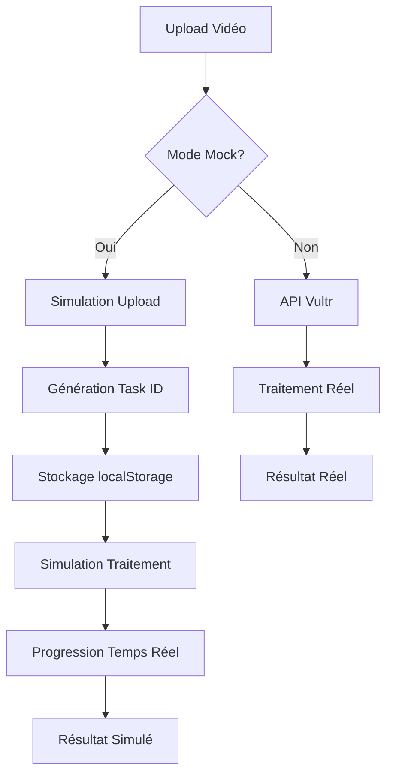

# 🎯 Résumé de l'Implémentation - Mode Mock StreamAI

## ✅ Ce qui a été implémenté

### 1. **Configuration Multi-Environnement**
- ✅ `.env.development` - Mode mock activé
- ✅ `.env.production` - Mode production avec API Vultr
- ✅ `frontend/src/config/api.ts` - Configuration centralisée

### 2. **Services API Modifiés**
- ✅ `videoProcessingAPI.ts` - Support mode mock avec simulation complète
- ✅ `recordingsService.ts` - Intégration des enregistrements locaux et traités
- ✅ Gestion localStorage pour persistance des états

### 3. **Traitement Local**
- ✅ `scripts/process_video_local.py` - Script Python pour traitement réel
- ✅ Intégration avec AIVIDEO existant
- ✅ Support des modèles Whisper (base, small, medium, large)

### 4. **Structure de Dossiers**
- ✅ `recordings/mock_uploads/` - Stockage simulé des uploads
- ✅ `processed_videos/` - Résultats du traitement local
- ✅ `scripts/` - Scripts de traitement

### 5. **Fonctionnalités Mock**
- ✅ Upload simulé avec progression réaliste
- ✅ Traitement progressif avec étapes détaillées
- ✅ Stockage des états dans localStorage
- ✅ Interface identique au mode production

### 6. **Documentation et Tests**
- ✅ `MOCK_MODE_GUIDE.md` - Guide complet d'utilisation
- ✅ `test_mock_mode.js` - Script de validation automatique
- ✅ `IMPLEMENTATION_SUMMARY.md` - Ce résumé

## 🔄 Workflow du Mode Mock



## 🎛️ Variables d'Environnement

| Variable | Développement | Production | Description |
|----------|---------------|------------|-------------|
| `VITE_MOCK_MODE` | `true` | `false` | Active/désactive le mode mock |
| `VITE_LOCAL_PROCESSING` | `true` | `false` | Traitement local vs distant |
| `VITE_API_BASE_URL` | `localhost:3000` | `45.32.145.22` | URL de l'API |

## 🚀 Utilisation

### Mode Développement (Mock)
```bash
cd frontend
npm run dev
# Interface avec simulation complète
```

### Mode Production (Réel)
```bash
cd frontend
npm run build
npm run preview
# Interface avec API Vultr réelle
```

### Test du Système
```bash
node test_mock_mode.js
# Validation de toute la configuration
```

## 📊 Fonctionnalités par Mode

### Mode Mock
- ✅ Upload simulé instantané
- ✅ Progression de traitement réaliste (14 secondes)
- ✅ Étapes détaillées (Whisper, édition, sous-titres)
- ✅ Résultats stockés en localStorage
- ✅ Interface identique à la production
- ✅ Pas de dépendances externes

### Mode Production
- ✅ Upload réel vers API Vultr
- ✅ Traitement GPU distant
- ✅ Résultats persistants
- ✅ Performance optimisée
- ✅ Scalabilité cloud

## 🔧 Points d'Extension

### Traitement Local Réel
Pour activer le traitement local réel (au lieu de la simulation) :

1. **Installer les dépendances** :
```bash
cd AIVIDEO
pip install -r requirements.txt
```

2. **Modifier le service** :
```typescript
// Dans videoProcessingAPI.ts
private async processVideoLocally(file: File, options: UploadOptions) {
  // Remplacer la simulation par un appel au script Python
  const result = await this.callPythonProcessor(file, options);
  return result;
}
```

### Intégration OBS
Les enregistrements OBS sont automatiquement détectés :
- Dossier : `recordings/recording_session_*/`
- Format : `.mkv`
- Métadonnées : Extraites du nom de fichier

### API Locale
Pour développer avec une API locale :
```bash
# Démarrer l'API locale
python video_processor_service.py

# Modifier .env.development
VITE_MOCK_MODE=false
VITE_API_BASE_URL=http://localhost:5001
```

## 🎯 Avantages de cette Implémentation

### Pour le Développement
- **Rapidité** : Pas d'attente de traitement réel
- **Fiabilité** : Résultats prévisibles
- **Offline** : Fonctionne sans internet
- **Debugging** : États visibles dans localStorage

### Pour la Production
- **Performance** : API Vultr optimisée
- **Scalabilité** : Traitement cloud
- **Persistance** : Données sauvegardées
- **Monitoring** : Logs et métriques

### Pour les Tests
- **Automatisation** : Tests E2E sans dépendances
- **Reproductibilité** : Résultats constants
- **Vitesse** : Tests rapides
- **Isolation** : Pas d'effets de bord

## 📈 Métriques de Simulation

### Temps de Traitement Simulé
- **Upload** : Instantané
- **Initialisation** : 2s
- **Extraction audio** : 2s
- **Transcription** : 2s
- **Analyse** : 2s
- **Édition** : 2s
- **Sous-titres** : 2s
- **Finalisation** : 2s
- **Total** : ~14 secondes

### Données Générées
- **Task ID** : `local_${timestamp}_${random}`
- **Progression** : 0% → 100% par étapes
- **Messages** : Étapes réalistes du traitement
- **Résultats** : Métadonnées simulées

## 🔍 Debugging

### Vérifier le Mode Actuel
```javascript
// Console navigateur
console.log('Mode:', import.meta.env.VITE_MOCK_MODE ? 'MOCK' : 'REAL');
```

### Voir les Données Mock
```javascript
// Lister toutes les tâches
Object.keys(localStorage).filter(k => k.startsWith('processing_'));

// Voir une tâche spécifique
JSON.parse(localStorage.getItem('processing_local_123'));
```

### Nettoyer les Données
```javascript
// Supprimer toutes les données mock
Object.keys(localStorage)
  .filter(k => k.startsWith('processing_'))
  .forEach(k => localStorage.removeItem(k));
```

## 🎉 Résultat Final

L'implémentation fournit :
- **Mode mock complet** pour le développement
- **Interface identique** en dev et prod
- **Traitement simulé réaliste** avec progression
- **Configuration flexible** par environnement
- **Tests automatisés** de validation
- **Documentation complète** d'utilisation

Le système est prêt pour le développement et peut basculer en production sans modification de code ! 🚀
